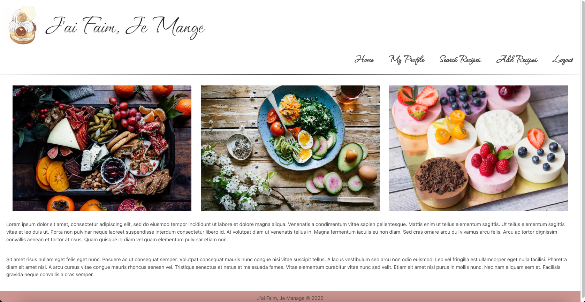
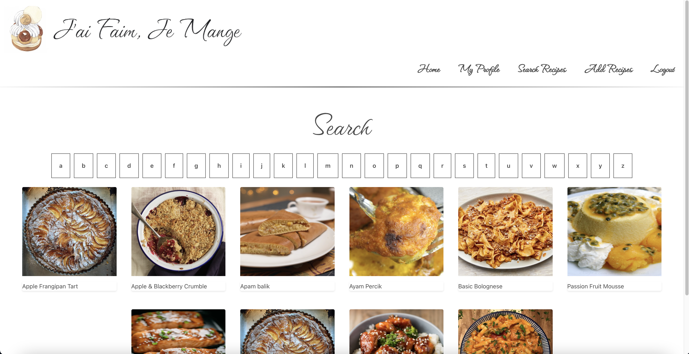

<strong>
<h1>J'ai Faim, Je Mange</h1> 
</strong>

<h1>Description:</h1>

- "J'ai Faim, Je Mange" translates from French to English as "I'm hungry, I eat"; a sentiment that all people can relate to. To that end, this is a Python/Django web application for users to search, collect, and add their favorite recipes to share with others. From college students, working adults, to busy parents, this is the best application to find the perfect meal!  
  
<h1>Getting Started:</h1>

Click [here](https://jai-104.herokuapp.com/) to access the website. 
- Click on "Login" to log in to the app if you're a returning user. 
- Click on "Sign Up" to create an account if you're a new user. 
- Once logged in, click on "Search Recipes" to browse our massive selection of recipes. 
- Or, click on "Add Recipes" to add your favorite recipes! 
- Click on any meal to access the recipe details. Then click on "Add to Collection" to favorite the meal or click on "Remove from Collection" to unfavorite. 

[Trello](https://trello.com/b/SrjdYvBd/jai-faim-je-mange)

<h1>Screenshots:</h1>

- Below is a screenshot of the Login Page: 
   

- Below is a screenshot of the Landing Page: 
   

- Below is a screenshot of the page to search for meals and recipes: 
    

<h1>Technologies Used:</h1>

* JavaScript  
* HTML  
* CSS  
* Flexbox  
* Git  
* Python  
* Django  
* Heroku  
* Bulma   

<h1>Next Steps:</h1>

* Have the "Add to Collection" and "Remove from Collection" buttons alternate depending on whether user has added or removed the meal from their profile. 
* Add functionality to see and follow other users. 
* Fix bug where recipes from the API show up twice after they've been favorited. 
* Fix header to top of page. 